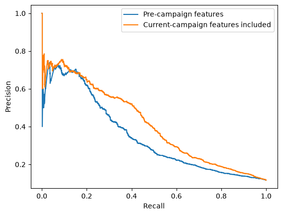
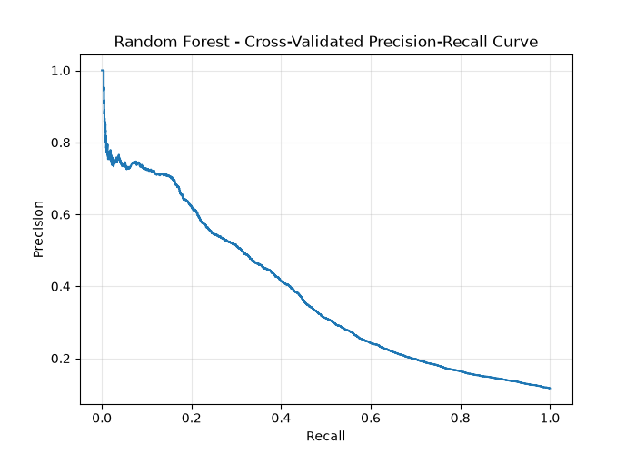

## Exploratory Data Analysis:
My approach was:
1. What we predict, what `y` represents, and what its distribution looks like.
2. Plot feature vs. outcome `y`, how each feature contributes to `y`. For numerical data I use box plots, histograms for example, for categorical data I use bar charts.
3. Drop those features which we don't know at classification time.
4. Plot feature comparisons.

This script covers the eda: `<repo-root>/data/notebooks/eda.ipynb`

## Data preprocess results
During the EDA phase, I discovered the features of the dataset; how to scale them based on their distribution or how to interpret them first and convert them to properly use (e.g. `pdays`). Therefore I made the following steps:
1. Implemented the scaling functions
2. Loaded the dataset and split into train and test
3. Dropped features
4. Separated features based on type (categorical and numerical).
5. Scaled features
6. Trained with Logistic Regression, Decision tree and Random Forest
7. Evaluated the results.


This script covers my attempts: `<repo-root>/data/notebooks/experiments.ipynb`

This result shows us that the model performs better when current campaign features included, because they contain information that is unavailable at prediction time. Therefore, I dropped them in the final trainings.

## Train pipeline
`train.py` is the full standardized training pipeline which is the result of my two previously mentioned notebooks. The goal was to make the training process modular and reproducible.
I used the pipeline module from scikit-learn to standardize the preprocessing. For evaluation, I used the scikit-learn's precision, recall and f1 score metrics.
The script implements three ML models: Logistic regression, Decision tree and Random forest.
All of them have some pre-set hyperparameters and scikit-learn's GridSearchCV helps to decide which is the best model on this data based on cross-validation.

```
Training: logistic_regression
Best CV AP: 0.3464974445859103
Best parameters: {}
Training: decision_tree
Best CV AP: 0.35298061316833473
Best parameters: {'model__max_depth': 10, 'model__min_samples_leaf': 50}
Training: random_forest
Best CV AP: 0.38026211810820787
Best parameters: {'model__max_depth': 10, 'model__min_samples_leaf': 10, 'model__n_estimators': 200}
Model comparison: 
logistic_regression: 0.3464974445859103 mean CV AP.
decision_tree: 0.35298061316833473 mean CV AP.
random_forest: 0.38026211810820787 mean CV AP.
OOF threshold selection:
Selected model: random_forest
Threshold: 0.18145248856467774
Precision: 0.40385056154022464
Recall: 0.4164500118175372
F1: 0.41005352571561554
Final test set evaluation
Threshold: 0.18145248856467774
Average Precision: 0.3905019158575219
Precision: 0.40951492537313433
Recall: 0.41493383742911155
F1: 0.41220657276995304
Confusion matrix: [[7352  633]
 [ 619  439]]
```



## My interpretation of the results:

The selected model based on GridSearchCV is the random forest. `Best CV AP: 0.38026211810820787`. We can see that the performance of the selected model is very similar on the final test set compared to the validation sets. 
Since the business goal does not state the relative cost of false positives and false negatives, I used the F1 score to balance precision and recall. I used stratified cross validation to have roughly the same distribution of the 'yes' and 'no' customers across the folds. Out-of-fold (OOF) predictions were used for setting the optimal threshold which balances between the precision and recall. 
`Threshold: 0.18145248856467774`

Lowering the threshold from 0.5 introduces more false positives, however we could catch more customers who would subscribe in the next campaign.

The final confusion matrix contains 7352 TN, 633 FP, 619 FN, and 439 TP predictions. The model on the majority class predicts well, however the single accuracy metric is not enough in this case, it would rely largely on the majority class. Therefore, accuracy alone would be misleading, with precision, recall and F1 score metrics, we have significantly more information about our model performance.
